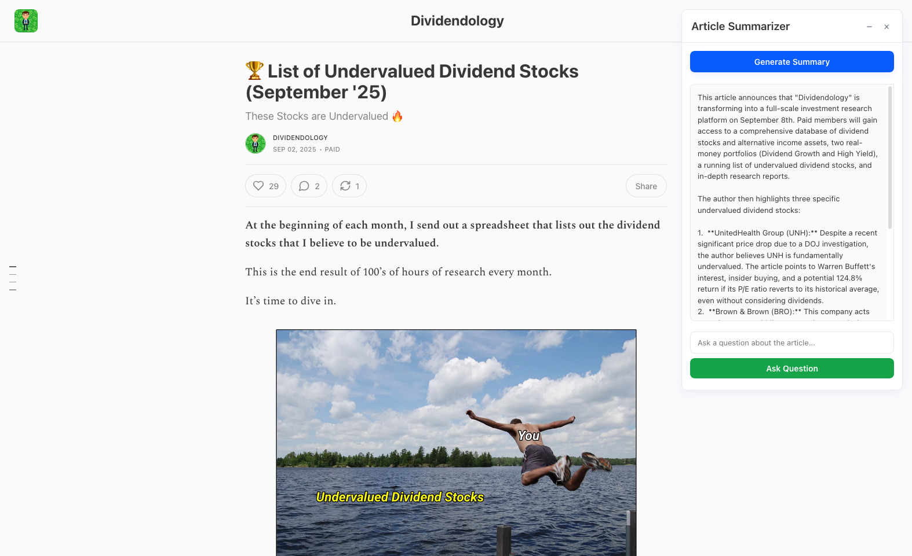

# Substack AI Summarizer

A browser extension that uses AI to summarize Substack articles directly on the page.

## Setup
1. Obtain a Gemini API key from Google AI Studio. You can get one by visiting [Google AI Studio](https://aistudio.google.com/) and creating a new API key.
2. Replace the `GEMINI_API_KEY` and/or `MODEL_ID` in `background.js` with your own key and preferred model.
3. Update the `manifest.json` to target specific Substack newsletters.

## Extension Showcase

